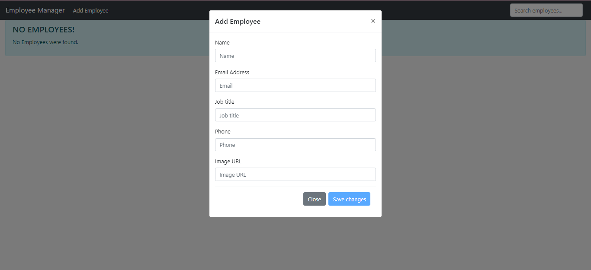
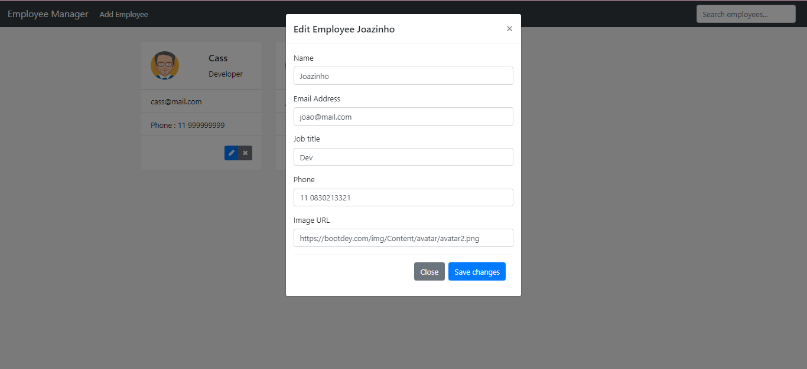

# Back-end repository: 
<a href="https://github.com/CassRamos/employee_manager_backend" target="_blank"> Click here to check out the Java back-end of this project</a>
 
 

<h1 align="center"> Employee manager </h1>

  

This repository is a front-end file of movies application 

  <a href="#-tecnologies">Tecnologies</a>&nbsp;&nbsp;&nbsp;|&nbsp;&nbsp;&nbsp;
  <a href="#-project">Project</a>&nbsp;&nbsp;&nbsp;|&nbsp;&nbsp;&nbsp;
  <a href="#memo-license">License</a>

  

 

## 🚀 Tecnologies

This project was developed with the following technologies:

- JavaScript & Angular
- Html & CSS
- Node.js
- Git & Github 
 

## 💻 Project

This project is responsible for promoting an employee management interface, with basic functions create, edit, delete (CRUD).

 - Here is an example for creating an employee:

  

- Populating the fields:

  

## :memo: License

This project is under license from MIT

 

# Employeemanager

This project was generated with [Angular CLI](https://github.com/angular/angular-cli) version 16.0.2.

## Development server

Run `ng serve` for a dev server. Navigate to `http://localhost:4200/`. The application will automatically reload if you change any of the source files.

## Code scaffolding

Run `ng generate component component-name` to generate a new component. You can also use `ng generate directive|pipe|service|class|guard|interface|enum|module`.

## Build

Run `ng build` to build the project. The build artifacts will be stored in the `dist/` directory.

## Running unit tests

Run `ng test` to execute the unit tests via [Karma](https://karma-runner.github.io).

## Running end-to-end tests

Run `ng e2e` to execute the end-to-end tests via a platform of your choice. To use this command, you need to first add a package that implements end-to-end testing capabilities.

## Further help

To get more help on the Angular CLI use `ng help` or go check out the [Angular CLI Overview and Command Reference](https://angular.io/cli) page.
